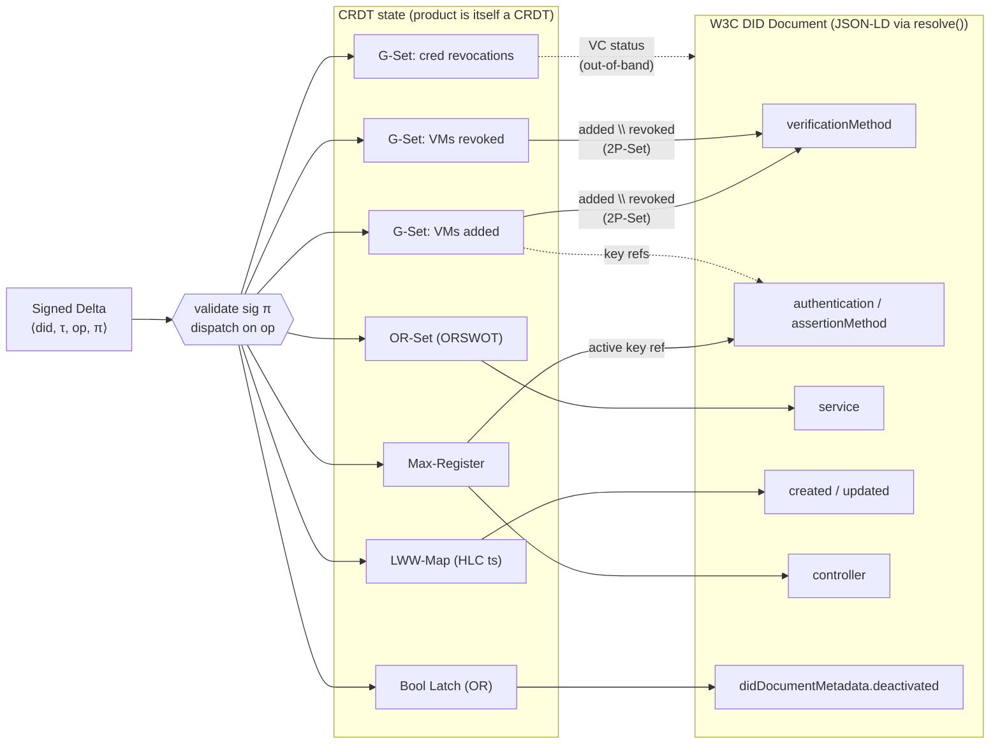

# did-crdt

[](#)
[](#license)
[](rust-toolchain.toml)
[](https://www.w3.org/TR/did-core/)
[](#build)

Coordination-free Decentralised Identifiers via signed CRDTs.

`did:crdt` is a [W3C DID Core 1.0](https://www.w3.org/TR/did-core/) compliant DID method that uses Conflict-Free Replicated Data Types to achieve consensus-free identity management. Based on the CALM theorem, all DID operations are reformulated as monotonic, coordination-free operations — no blockchain, no transaction fees, no confirmation delay.

## Why

Existing DID methods force a choice between decentralisation and usability:

- **Blockchain-anchored methods** (`did:ethr`, `did:hedera`) incur per-update fees and seconds-to-minutes confirmation latency.
- **Lightweight peer methods** (`did:key`, `did:peer`) offer no update mechanism — keys cannot be rotated, services cannot be edited.
- **Sidetree methods** batch off-chain but still require blockchain ordering for finality.

`did:crdt` eliminates coordination entirely. By the CALM theorem, replicas that have received the same updates reach the same state without consensus, fees, or connectivity. The delta admission path requires causal delivery; convergence is guaranteed once all causally prior deltas arrive.

## Architecture



An incoming signed delta is signature-verified and dispatched to the appropriate CRDT field. Verification methods and their revocations form a 2P-Set (`authorized = added \ revoked`). The product of these seven CRDTs is itself a CRDT — by the CALM theorem the state-based merge is order-independent — and is projected to a W3C DID Document by `resolve()`. Credential revocations live in a separate G-Set consumed by VC verifiers, not the DID Document itself.

## Features

- **Pure core with zero I/O** — deterministic CRDT logic with no async, no side effects
- **CRDT composition** — G-Set, OR-Set, LWW-Map, and Max-Register fields per document
- **Multi-key signatures** — Ed25519 and secp256k1 with Linked-Data Proofs
- **Hybrid Logical Clocks** — causal ordering even under clock skew
- **P2P sync** — delta propagation via iroh-gossip (feature-gated)
- **HTTP service** — axum-based REST API with Prometheus metrics (feature-gated)
- **WASM compatible** — core compiles to `wasm32-unknown-unknown`
- **Property-tested** — commutativity, associativity, and idempotence verified via proptest

## Quick start

```rust
use did_crdt::core::document::Document;

// Create a new DID
let (doc, genesis_delta) = Document::new(public_key_multibase);

// The DID is derived from the blake3 hash of the genesis delta
println!("{}", doc.did()); // did:crdt:a1b2c3...

// Merge a signed delta from another replica
doc.merge(signed_delta);

// Resolve to W3C DID Document (JSON-LD)
let did_document = doc.resolve();
```

## Build

```bash
# Core only (no I/O, no async)
cargo build --no-default-features

# With P2P sync
cargo build --features sync

# Full service binary
cargo build --release --features service,sync
```

## Test

```bash
cargo test                    # default features
cargo test --all-features     # everything
cargo test --no-default-features  # core only
```

## Run the service

```bash
cargo run --release --features service,sync --bin did-crdt-service
```

| Variable | Default | Description |
|---|---|---|
| `LISTEN_ADDR` | `0.0.0.0:8080` | HTTP listen address |
| `PEERS` | — | Comma-separated peer list |
| `STORAGE_PATH` | — | Persistent storage directory |

### Docker

```bash
docker build -t did-crdt .
docker run -p 8080:8080 did-crdt
```

### API

| Method | Path | Description |
|---|---|---|
| `POST` | `/dids` | Create a new DID |
| `GET` | `/:did` | Resolve DID to W3C document |
| `POST` | `/dids/:did/deltas` | Submit a signed delta |
| `GET` | `/metrics` | Prometheus metrics |

## Architecture

```
src/
├── core/          # Pure CRDT logic (no I/O)
│   ├── crdt.rs    # CRDT field types
│   ├── delta.rs   # Signed deltas with Linked-Data Proofs
│   ├── document.rs# Document CRDT composition
│   ├── hlc.rs     # Hybrid Logical Clock
│   ├── resolve.rs # CRDT state → W3C DID Document projection
│   └── validate.rs# Signature and state validation
├── sync/          # P2P via iroh (feature: sync)
├── service/       # HTTP API via axum (feature: service)
├── anchor/        # Pluggable anchoring trait (feature: anchor)
└── bin/           # Service entry point
```

The core is a pure function: `merge(state, delta) → state`. It is commutative, associative, and idempotent — replicas converge regardless of message order, duplication, or delay.

## Benchmarks

```bash
cargo bench --bench merge
cargo bench --bench resolve
```

## Specifications

- [did:crdt Specification](specs/did-crdt-spec.md) — full method specification
- [DID Method Spec](specs/did-method-spec.md) — W3C DID Core conformance
- [ADR-001](docs/adr/ADR-001-compaction-gc-strategy.md) — Compaction & GC
- [ADR-002](docs/adr/ADR-002-key-compromise-recovery.md) — Key compromise recovery
- [ADR-003](docs/adr/ADR-003-sybil-resistance.md) — Sybil resistance
- [ADR-004](docs/adr/ADR-004-state-size-limits.md) — State size limits

## License

MIT OR Apache-2.0
